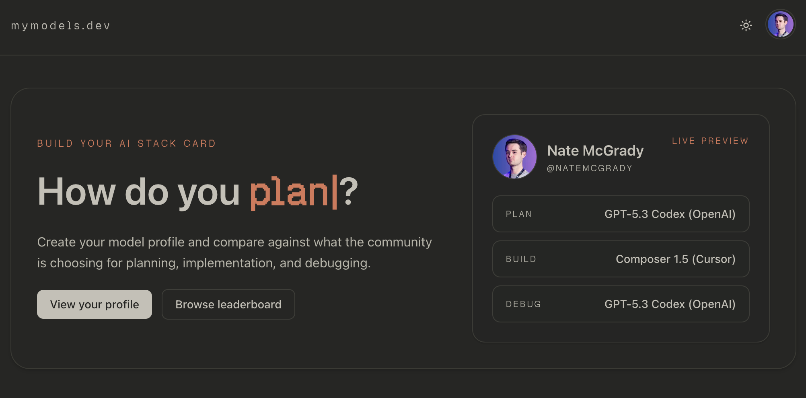

# MyModels.dev

**MyModels.dev** lets you build an AI Stack Card—a profile that defines the AI models you use across different phases of development. Create your model profile to share your choices for planning, implementation, and debugging, compare them against what the community is using, and browse the leaderboard.
